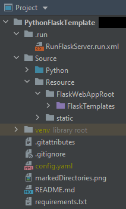

# Python Flask Template

Simple project for storing and retrievied arbitrary resources based on an identifier.

## Setup

Create a config file called `config.yaml` in the project root folder with the following:

```yaml
---
# Configuration for PythonFlaskTemplateApp
app_config:
  name: Python Flask Template
  description: "Python Flask Template demonstrates a simple rest application using Flask"


# Configuration for Flask web service
flask_construction_config:
  root_path: "/path/to/project/Source/Resource/FlaskWebAppRoot" # Have not figured out how to make this relative
  static_folder: "../static" # Relative to root_path
  static_url_path: "/static"
  template_folder: "FlaskTemplates" # Relative to root_path

flask_run_config:
  debug: True
  host: localhost
  port: 1337
```

Mark directories as Source Root, Resource Root, and Template Folder as follows:


